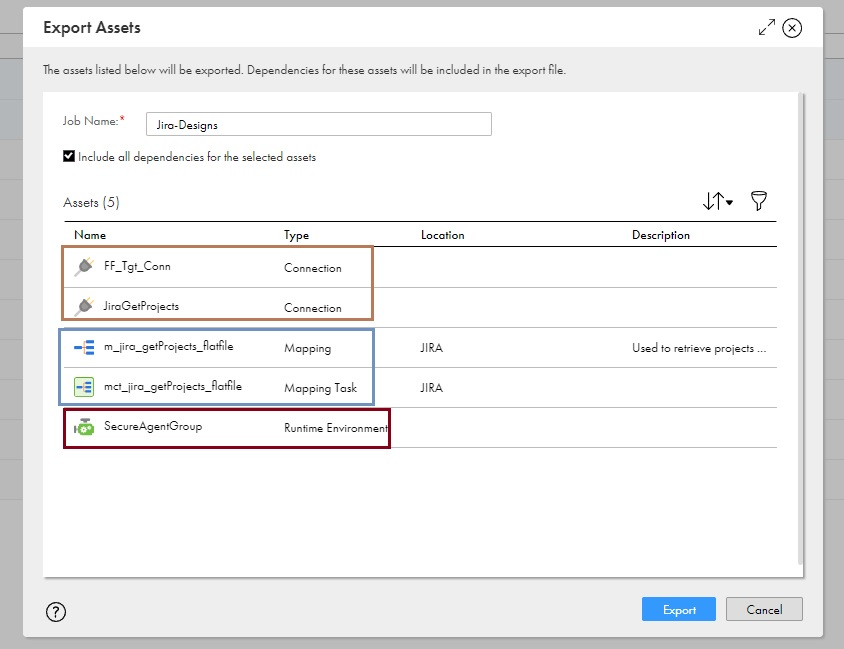
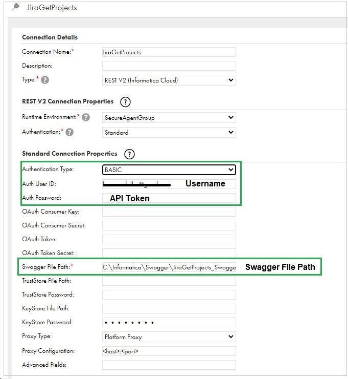
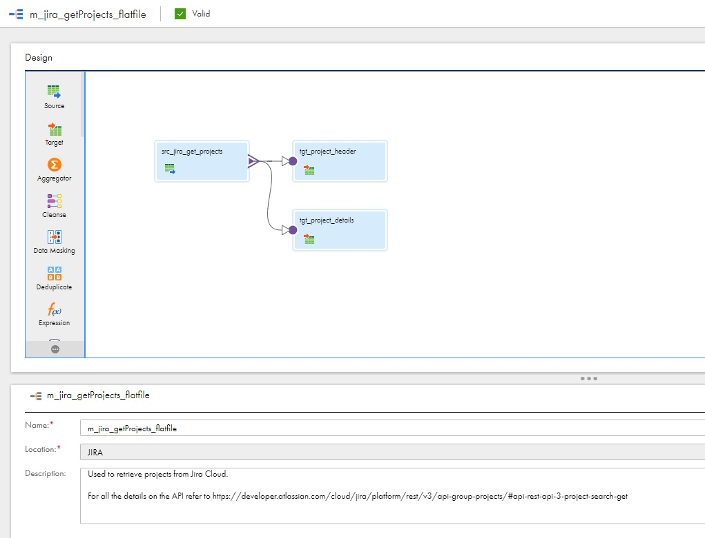
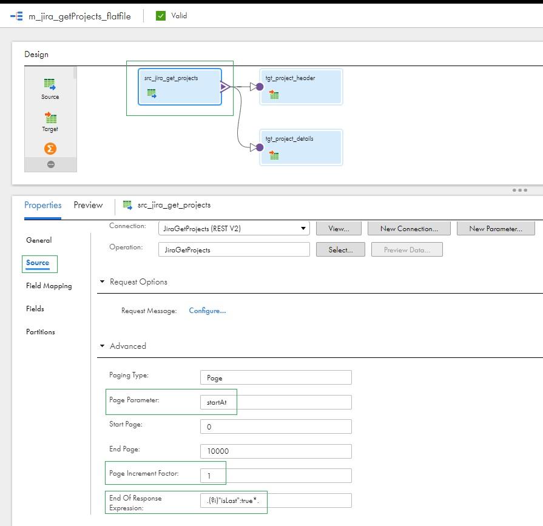
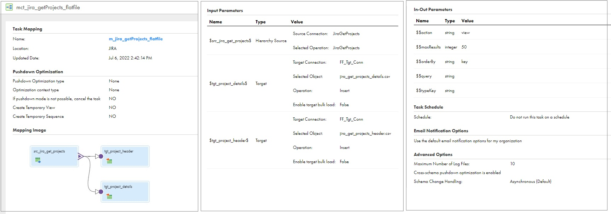

# Informatica Cloud (CDI) Jira Integration using REST APIs

This project contains set of re-usable Informatica Cloud (CDI) design assets to demonstrate how CDI REST V2 connection can be used to interact with Jira Cloud. Most of the use-cases can be implemented using out-of-the-box Jira CDI connector, but this method can be used if some objects or operations aren't available in the OOB connector.

[Click Here](https://docs.informatica.com/integration-cloud/cloud-data-integration-connectors/current-version/jira-cloud-connector/introduction-to-jira-cloud-connector/jira-cloud-connector-overview.html) to read the details about the native CDI Jira connector.

This projects demonstrates how Jira Cloud REST APIs can be used to retrieve projects from Jira Cloud along with option for providing filtering conditions.

<!-- TOC -->
- [Informatica Cloud (CDI) Jira Integration using REST APIs](#informatica-cloud-(cdi)-jira-integration-using-rest-apis)
  - [Design Assets](#design-assets)
  - [Download Design Assets](#download-design-assets)
  - [Setup](#setup)
    - [Jira Configurations](#jira-configurations)
    - [Informatica Cloud Configurations](#informatica-cloud-configurations)
  - [Design Details](#design-details)
    - [Mapping: m_jira_getProjects_flatfile](#mapping:-m_jira_getProjects_flatfile)
    - [Mapping Task: m_jira_getProjects_flatfile](#mapping-task:-mct_jira_getProjects_flatfile) 
  - [Run Integration](#run-integrations)
  
<!-- /TOC -->

## **Design Assets**

Below are the list of design assets included in the this project.

| Asset Name                        | Type                          | Description                                                                                                       |
| ----------------------------------|-------------------------------|-------------------------------------------------------------------------------------------------------------------|
| JiraGetProjects_Swagger.json   | Swagger File             | Used by RESTV2 connector. Copy this file on the secure agent or a network file share and then provide the file path on the RESTV2 connection                                                                    |
| FF_Tgt_Conn   | Flat File Connection                | Flat file connection used to write results from Jira Cloud API to flat files                                                         |
| JiraGetProjects       | RESTV2 Connection                       | Rest Connection used to interact with Jira Cloud APIs                                               |
| m_jira_getProjects_flatfile                  | Mapping                       | Mapping template with the business logic to connect to Jira Cloud and write to the flat file target                                                                    |
| mct_jira_getProjects_flatfiles                 | Mapping Task                       | Mapping Task which can accept the query parameters and execute the integration                                                          |
| SecureAgentGroup            | Runtime Environment                       | Target runtime environment                                                     |                                                  |

## **Download Design Assets**

Use following links to download the designs assets.

1. Swagger File [Click Here to Download](./designs/latest/JiraGetProjects_Swagger.json)
2. Informatica Cloud Design Assets [Click Here to Download](./designs/latest/JiraCloud-CDI-RESTv2.zip)

## **Setup**

### **Jira Configurations**
Jira Cloud no longer supports basic authentication with username & password, instead we need to use either API Token or OAuth.

If you already have an API token or OAuth details skip this section if not use below instructions to generate a new API token.

Create an API token from your Atlassian account:
  1. Log in to https://id.atlassian.com/manage-profile/security/api-tokens
  2. Click Create API token.
  3. From the dialog that appears, enter a memorable and concise Label for your token and click Create.
  4. Click Copy to clipboard, then paste the token to your script, or elsewhere to save:

For further details about the Jira Cloud API Token [Click Here](https://support.atlassian.com/atlassian-account/docs/manage-api-tokens-for-your-atlassian-account/)

### **Informatica Cloud Configurations**
Instructions to import and setup Informatica Cloud designs.
1. Update the Swagger file to use your  Jira Cloud Instance "[jira-instance-name]". For example, a Jira Cloud instance name will look something like "instance1-jira.atlassian.net" 
2. Login into Informatica Cloud and select Cloud Data Integration service and go to Explore menu.
3. Then click Import and select the downloaded JiraCloud-CDI-RESTv2.zip file
4. Update the target project name if required, if not design assets will be imported into project named "JIRA".
5. **FF_Tgt_Conn**: If you have an existing flat file connection you can map that connection if not it will create new connection with the same name. Update the directory path on the connection if new connection is created.
6. **JiraGetprojects**: REST V2 connection
7. **SecureAgentGroup**: Pick the correct runtime environment for you organization
8. Test and import the design assets.

9. Once all design assets are successfully imported, from the Administrator Service review JiraGetprojects RESTV2 connection
    1. Authentication Type = Basic
    2. Provide Auth User Id (Jira user)
    3. Provide Auth Password = API Token Generated from Jira
    4. Update Swagger file path as needed
    5. Test and Save Connection Configurations
    
      

Alternatively if you have setup an OAuth connectivity for Jira Cloud you can provide the OAuth details(Consumer Key. Consumer Secret) by changing the Auth Type to OAuth.
## **Design Details**

###  **Mapping**: m_jira_getProjects_flatfile
Mapping Template which can retrieve projects using  Jira Cloud REST APIs. Integration uses paginated get projects API to retrieve the projects. Click this link to get all the details on the API used. [Click Here](https://developer.atlassian.com/cloud/jira/platform/rest/v3/api-group-projects/#api-rest-api-3-project-search-get) 

Source transformation uses REST web-service to get the projects and supports following query parameters.
| Name                  | Description                                                                                           |
| --------------        | ------------------------------------------------------------------------------------------------------|
| action            | Filter results by projects for which the user can: view , browse ,edit. Default is view	                    |
| maxResults     | The maximum number of items to return per page. Default: 50	    |
| orderBy                 | Order the results by a field. Example: category, issueCount ,key, lastIssueUpdatedTime etc.	                            |
| query                | Filter the results using a literal string. Projects with a matching key or name are returned (case insensitive).	                       |
| typeKey                | Orders results by the project type. This parameter accepts a comma-separated list. Valid values are business, service_desk, and software. |

Pagination is handled using a parameter called **startAt**, this is used within Advanced Properties under source transformation. To determine the last API call for pagination Informatica Cloud uses "End of response expression" or "End Page", between the two attributes whichever happens first will stop the next API calls.

If you expect to retrieve huge number of records adjust the "End Page" parameter value (Default is 10,000) attribute accordingly so that API calls do not stop before we retrieve all the records. **We need to make sure that "End of response expression" occurs before we hit "End Page"**.

###  **Mapping Task**: mct_jira_getProjects_flatfile

Mapping Task can be used to set the query parameter as required and then execute the integration job to retrieve projects from Jira Cloud. Same mapping task can be executed multiple times with different set of query parameter values.

## **Run Integration Job**

Open and click edit mapping task and then set the query parameters as required and click finish to Save changes. If no query parameters are changed default values will be used for the API call. 

Run the mapping task and you can check results from the "My Jobs" or "Monitor" Service.

